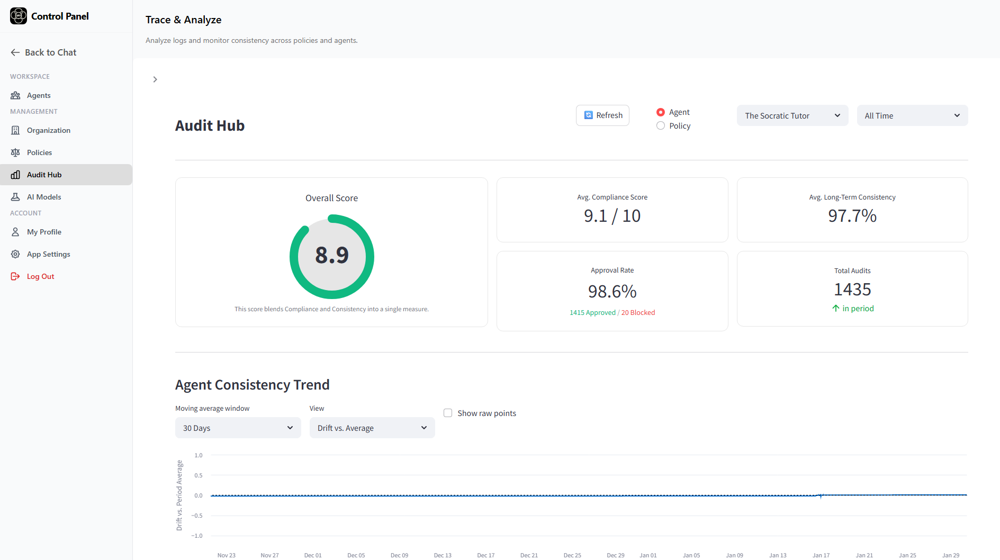

[](https://github.com/jnamaya/SAFi/stargazers)
[](https://github.com/jnamaya/SAFi/forks)
[](License.txt)
[](https://www.python.org/)
[](https://safi.selfalignmentframework.com)

# SAFi: The Runtime Governance Engine for AI

<p align="center">
  
</p>

## Introduction

SAFi is an enterprise-level, closed-loop runtime governance engine for AI, designed to bridge the gap between organizational values and artificial intelligence behavior. It is built upon four core principles:

| Principle | What It Means | How SAFi Delivers It |
| :--- | :--- | :--- |
| **🛡️ Policy Enforcement** | You define the operational boundaries your AI must follow, protecting your brand reputation.| Custom policies are enforced at the runtime layer, ensuring your rules override the underlying model's defaults.  |
| **🔍 Full Traceability** | Every response is transparent, logged, and auditable. No more "black boxes." | Granular logging captures every governance decision, veto, and reasoning step across all faculties, creating a complete forensic audit trail. |
| **🔄 Model Independence** | Switch or upgrade models without losing your governance layer. | A modular architecture that supports GPT, Claude, Llama, and other major providers. |
| **📈 Long-Term Consistency** | Maintain your AI’s ethical identity over time and detect behavioral drift. | SAFi introduces stateful memory to track alignment trends, detect drift, and auto-correct behavior. |

## Table of Contents

1.  [How Does It Work?](#how-does-it-work)
2.  [Technical Implementation](#technical-implementation)
3.  [Application Structure](#application-structure)
4.  [Application Authentication](#application-authentication)
5.  [Permissions](#permissions)
6.  [Headless Governance Layer](#headless-governance-layer)
7.  [Agent Capabilities](#agent-capabilities)
8.  [Developer Guide](#developer-guide)
9.  [Quick Start with Docker](#quick-start-with-docker)
10. [Installation on Your Own Server](#installation-on-your-own-server)
11. [Live Demos](#live-demos)
12. [Contributing](#-contributing)

## How Does It Work?

SAFi implements a cognitive architecture primarily derived from the **Thomistic faculties of the soul** (Aquinas). It maps the classical concepts of *Synderesis*, *Intellect*, *Will*, and *Conscience* directly to software modules, while adapting the concept of *Habitus* (character formation) into the **Spirit** module.

1.  **Values (Synderesis):** The core constitution (principles and rules) that defines the agent's identity and governs its fundamental axioms.
2.  **Intellect:** The generative engine responsible for formulating responses and actions based on the available context.
3.  **Will:** The active gatekeeper that decides whether to approve or veto the Intellect's proposed actions before execution.
4.  **Conscience:** The reflective judge that scores actions against the agent's core values after they occur (post-action audit).
5.  **Spirit (Habitus):** The long-term memory that integrates these judgments to track alignment over time, detecting drift and providing coaching for future interactions.

**💡 Note: Philosophy as Architecture**

Just as airplanes were inspired by birds but do not utilize feathers or biology, SAFi is inspired by the **structure** of the human mind but is a concrete software implementation.

We use these philosophical concepts not as metaphysics, but as **System Design Patterns**. By treating "Will" and "Intellect" as separate software services, we solve the "Hallucination vs. Compliance" conflict that monolithic models struggle with.

## Technical Implementation

The core logic of the application resides in **`safi_app/core`**. This directory contains the `orchestrator.py` engine, the `faculties` modules, and the central `values.py` configuration.

*   **`orchestrator.py`**: The central nervous system of the application. It coordinates the data flow between the user, the various faculties, and external services.
*   **`values.py`**: Defines the "constitution" for the system. This file governs the ethical profiles of all agents, which can be configured manually in code or via the frontend Policy Wizard.
*   **`intellect.py`**: Acts as the Generator. It receives context from the Orchestrator and drafts responses or tool calls using the configured LLM.
*   **`will.py`**: Acts as the Gatekeeper. It evaluates the Intellect's draft against the active policy. If a violation is detected, it rejects the draft and requests a retry. If the retry fails, the response is blocked entirely.
*   **`conscience.py`**: Acts as the Auditor. It performs an asynchronous deep-dive audit of every approved response, scoring it on a -1 to 1 scale against specific ethical rubrics.
*   **`spirit.py`**: Acts as the Long-Term Integrator. It aggregates Conscience scores (mapped to a 1-10 scale), updates the agent's alignment vector, and mathematically calculates "drift" implementation to generate coaching notes for future responses.

## Application Structure

SAFi is organized into the following functional areas:

*   **Agents:** Create, configure, and manage AI agents with custom tools and policies.
*   **Organization:** Configure global settings, including domain claims, policy weighting, and long-term memory drift sensitivity.
*   **Policies:** Manage the creation of custom Policies (Constitutions) and generate API keys.
*   **Audit Hub:** A comprehensive dashboard for viewing decision logs, audit trails, and ethical ratings for every interaction.
*   **AI Model:** Configure and switch between underlying LLM providers (e.g., OpenAI, Anthropic, Google) for each faculty.
*   **My Profile:** Personalize the experience by defining individual User Values, Interests, and Goals that the AI will remember and adapt to.
*   **App Settings:** Manage application preferences, including Themes (Light/Dark) and **Data Source Connections** (Google Drive, OneDrive, GitHub).

## Application Authentication

SAFi uses OpenID Connect (OIDC) for user authentication. You must configure **Google** and **Microsoft** OAuth apps to enable login and data source integrations.

### 1. Google Setup
1.  Go to the [Google Cloud Console](https://console.cloud.google.com/).
2.  Create a new project and configure the "OAuth consent screen".
3.  Create **OAuth 2.0 Client IDs** (Web application).
4.  **Authorized Redirect URIs**:
    *   `http://localhost:5000/api/callback` (Login)
    *   `http://localhost:5000/api/auth/google/callback` (Drive Integration)
5.  Copy `Client ID` and `Client Secret` to your `.env` file (`GOOGLE_CLIENT_ID`, `GOOGLE_CLIENT_SECRET`).

### 2. Microsoft Setup
1.  Go to the [Azure Portal](https://portal.azure.com/) > App registrations.
2.  Register a new application (Accounts in any organizational directory + personal Microsoft accounts).
3.  **Redirect URIs** (Web):
    *   `http://localhost:5000/api/callback/microsoft` (Login)
    *   `http://localhost:5000/api/auth/microsoft/callback` (OneDrive Integration)
4.  Create a **Client Secret** in "Certificates & secrets".
5.  Copy `Application (client) ID` and the Secret Value to your `.env` file (`MICROSOFT_CLIENT_ID`, `MICROSOFT_CLIENT_SECRET`). 

## Permissions

The system utilizes a Role-Based Access Control (RBAC) system:

*   **Admin:** Complete access to all system settings, including global Organization configurations.
*   **Editor:** Access to manage Governance policies, AI Agents, and view Traces, but restricted from modifying Organization-wide settings.
*   **Auditor:** Read-only access to Organization settings, Governance policies, and Trace logs for compliance verification.
*   **Member:** Standard access to Chat and Agents. The Management menu is hidden.

## Headless Governance Layer

SAFi can be configured as a **"Governance-as-a-Service"** layer for any external application or existing agent frameworks (such as **LangChain**). It has been tested with Microsoft Teams, Telegram, and WhatsApp.

### How to use it:

1.  **Generate a Policy Key:**
    *   Go to **Policies**.
    *   Create or Edit a Policy.
    *   You will get the API key at the end of the wizard or you can generate a new key for existing policies. 

2.  **Call the API:**
    Make a POST request to your SAFi instance from your external bot code.

    **Endpoint:** `POST /api/bot/process_prompt`
    **Headers:**
    ```
    Content-Type: application/json
    X-API-KEY: sk_policy_12345...
    ```
    **Payload:**
    ```json
    {
      "user_id": "teams_user_123",       // Unique ID from your platform
      "user_name": "John Doe",           // Optional: Display name for audit logs
      "message": "Can I approve this expense?",
      "conversation_id": "chat_456",     // Thread ID for memory context
      "persona": "safi"                  // Optional: Agent profile to use
    }
    ```

3.  **Response:**
    SAFi will process the prompt, enforcing the Policy associated with the API Key, and return the governed response:
    ```json
    {
      "finalOutput": "Based on company policy, expenses under $500 can be...",
      "sources": [                       // Optional: RAG references if applicable
        {"title": "Expense Policy", "url": "https://..."}
      ]
    }
    ```
    Users are automatically registered in the system ("Just-in-Time" provisioning) so you can audit their interactions in the Audit Hub. 

## Agent Capabilities

SAFi is designed to be extensible, supporting multiple data sources including RAG (Retrieval-Augmented Generation), MCP (Model Context Protocol), and custom plugins.

The demo environment includes several specialized agents to showcase these capabilities:

* **The Contoso Admin:** Showcases the application of organizational governance policies. This agent retrieves Standard Operating Procedures (SOPs) from a RAG vector database, demonstrating how SAFi strictly enforces data privacy and prevents PII leaks during document retrieval.
*   **The Fiduciary:** A financial specialist using **tool-calling** to access live market data and portfolio information, demonstrating secure integration with sensitive APIs.
*   **The Bible Scholar:** Demonstrates **RAG** capabilities by strictly referencing a fixed corpus (the Bible) to provide accurate citations and theological analysis without hallucination.
*   **The Health Navigator:** An informational guide using **Geospatial MCP Tools** to find healthcare providers. Demonstrates SAFi's enforcement of safety policies—the Will faculty ensures every response includes the mandatory medical disclaimer and rejects any attempt to provide diagnoses or treatment advice.
*   **The Socratic Tutor:** A math and science tutor that uses the **Socratic method**—guiding students through questions rather than giving answers. The Will faculty enforces pedagogical integrity by rejecting any response that provides direct solutions, ensuring students learn through productive struggle.


## Developer Guide

Refer to this guide to extend SAFi with new data sources and capabilities.

### 1. How to Add a New Data Source (MCP Tool)

Use MCP to give an agent "tools" (e.g., searching a database, posting to Slack).

1.  **Create the Tool Implementation:**
    Navigate to `safi_app/core/mcp_servers/` and create a new Python file (e.g., `slack.py`). Define your async functions here.

2.  **Register the Tool Logic:**
    Open `safi_app/core/services/mcp_manager.py`.
    *   **Add Schema:** Update `get_tools_for_agent` to include the JSON schema (name, description, inputs).
    *   **Add Routing:** Update `execute_tool` to import your module and dispatch the call.

3.  **Enable for an Agent:**
    Open `safi_app/core/values.py` (or use the frontend Wizard).
    Add the tool name to the `tools` list in the agent's profile:
    ```python
    "tools": ["sharepoint_search", "slack_post_message"]
    ```

### 2. How to Add a New Knowledge Base (RAG)

Use RAG to give an agent a static "brain" of documents (e.g., a policy handbook).

1.  **Generate the Vector Index:**
    Process your text files into a FAISS index using the helper script `scripts/build_vector_store.py`. This generates two files:
    *   `my_knowledge.index`: The searchable vector data.
    *   `my_knowledge_metadata.pkl`: The map of text chunks to vectors.

2.  **Deploy the Files:**
    Place both files into the `vector_store/` directory.

3.  **Enable for an Agent:**
    Open `safi_app/core/values.py`.
    Set the `rag_knowledge_base` key in the agent's profile:
    ```python
    "rag_knowledge_base": "my_knowledge"
    ```

### 3. How to Add a Plugin (Prompt Interception)

Use Plugins to run logic *before* the prompt reaches the LLM (e.g., injecting context).

1.  **Create the Plugin:**
    Create a file in `safi_app/core/plugins/` (e.g., `weather_injector.py`).
    Write a function that accepts `user_prompt` and returns data or a modified prompt.

2.  **Hook Implementation:**
    Open `safi_app/core/orchestrator.py` and locate `process_prompt`.
    Add your plugin to the `plugin_tasks` list:
    ```python
    plugin_tasks = [
        # ... existing plugins
        weather_injector.get_weather(user_prompt...)
    ]
    ```

3.  **Context Injection:**
    The returned data is automatically collected into `plugin_context_data` and passed to the Intellect faculty.

## Quick Start with Docker

The fastest way to run SAFi is using our pre-built Docker image from Docker Hub.

### 1. Pull the Image

```bash
docker pull amayanelson/safi:v1.2
```

### 2. Run the Container

```bash
docker run -d \
  -p 5000:5000 \
  -e DB_HOST=your_db_host \
  -e DB_USER=your_db_user \
  -e DB_PASSWORD=your_db_password \
  -e DB_NAME=safi \
  -e OPENAI_API_KEY=your_openai_key \
  --name safi \
  amayanelson/safi:v1.2
```

### 3. Access the Application

Open your browser to `http://localhost:5000`

> **Note:** You still need an external MySQL 8.0+ database. The Docker image contains the application only.

---

## Installation on Your Own Server

You can host SAFi on any standard Linux server (Ubuntu/Debian recommended) or Windows machine.

### Prerequisites

*   **Python:** 3.11 or higher
*   **Database:** MySQL 8.0+ (Required for JSON column support)
*   **Web Server:** Nginx or Apache (for production reverse proxy)

### Step-by-Step Guide

1.  **Clone the Repository:**
    ```bash
    git clone https://github.com/jnamaya/SAFi.git
    cd SAFi
    ```

2.  **Prepare the Frontend:**
    The Flask backend expects the frontend files in a folder named `public`.
    ```bash
    mv chat public
    ```

3.  **Set Up Virtual Environment:**
    ```bash
    python -m venv venv
    # Linux/Mac
    source venv/bin/activate
    # Windows
    .\venv\Scripts\activate
    ```

4.  **Install Dependencies:**
    (If `requirements.txt` is missing, install the core packages manually)
    ```bash
    pip install flask mysql-connector-python authlib requests numpy openai groq anthropic google-auth-oauthlib python-dotenv
    ```

5.  **Configure Environment:**
    Copy the example configuration and edit it with your secrets.
    ```bash
    cp .env.example .env
    nano .env
    ```
    *   **Database:** Update `DB_HOST`, `DB_USER`, `DB_PASSWORD`.
    *   **LLMs:** Add your OpenAI/Anthropic/Groq keys.
    *   **Auth:** Add Google/Microsoft Client IDs (optional, but required for login).

6.  **Initialize Database:**
    Create an empty database in MySQL. SAFi will automatically create the tables on the first run.
    ```sql
    CREATE DATABASE safi CHARACTER SET utf8mb4 COLLATE utf8mb4_unicode_ci;
    ```

7.  **Run the Application:**
    ```bash
    # Development
    flask --app safi_app run --debug
    
    # Production (using Waitress or Gunicorn)
    pip install waitress
    waitress-serve --call "safi_app:create_app"
    ```

    ### 9. Production Proxy Configuration (Optional)

    If you are running behind a web server (recommended for SSL/HTTPS), configure it to forward traffic to SAFi.

    **Nginx Configuration:**
    ```nginx
    server {
        listen 80;
        server_name your-domain.com;

        location / {
            proxy_pass http://127.0.0.1:5000;
            proxy_set_header Host $host;
            proxy_set_header X-Real-IP $remote_addr;
            proxy_set_header X-Forwarded-For $proxy_add_x_forwarded_for;
        }
    }
    ```

    **Apache Configuration:**
    Ensure `mod_proxy` and `mod_proxy_http` are enabled.
    ```apache
    <VirtualHost *:80>
        ServerName your-domain.com

        ProxyPreserveHost On
        ProxyPass / http://127.0.0.1:5000/
        ProxyPassReverse / http://127.0.0.1:5000/
    </VirtualHost>
    ```


8.  **Access:**
    Open your browser to `http://localhost:5000` (or your server's IP).

> **Note on RAG:** To use the Bible Scholar or other RAG agents, you must generate the vector store first.
> `python -m safi_app.scripts.build_vector_store`

## Live Demos

### 🚀 Try SAFi Yourself

- **DEMO URL**: [safi.selfalignmentframework.com](https://safi.selfalignmentframework.com)
  
## About the Author

**Nelson Amaya** is a Cloud & Infrastructure IT Director and AI Architect specializing in Enterprise Governance and Cognitive Architectures. With over 20 years of experience in the IT space, Nelson built SAFi to solve the critical gap between rigid corporate policy and dynamic AI behavior.

* **Read the Philosophy:** [SelfAlignmentFramework.com](https://selfalignmentframework.com)
* **Connect on LinkedIn:** [linkedin.com/in/amayanelson](https://www.linkedin.com/in/amayanelson/)
* **Follow on Reddit:** [u/forevergeeks](https://www.reddit.com/user/forevergeeks/)